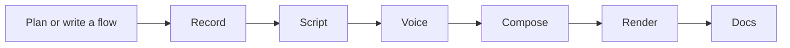

<h1>
  <picture>
    <source media="(prefers-color-scheme: dark)" srcset="https://raw.githubusercontent.com/Side-Products/tutorials-kit/v0.1.4/docs/assets/tutorials-kit-logo-dark.png">
    
  </picture>
</h1>

**Turn a browser workflow into a narrated video and a written guide.**

[](https://github.com/Side-Products/tutorials-kit/actions/workflows/ci.yml)
[](https://www.npmjs.com/package/tutorials-kit)
[](LICENSE)
[](package.json)


Define the steps once. Tutorials Kit drives your app with Playwright, records the screen and interaction
timings, generates editable narration, and renders a video with Remotion. The same recording produces
annotated screenshots, captions, and a structured guide that other tools can read.

Taking your walkthrough to social?
[Faceless](https://faceless.so/?utm_source=tutorials-kit&utm_medium=readme&utm_campaign=opensource&utm_content=intro)
offers a hosted workspace for caption styling, video editing, and publishing.
[See the optional workflow](docs/faceless.md).

[Ask your agent](#ask-your-agents-to-do-it-for-you) · [Install](#install-from-npm) ·
[Quick start](#quick-start) · [Configuration](docs/configuration.md) · [Pipeline](docs/pipeline.md) ·
[Contributing](CONTRIBUTING.md) · [Security](SECURITY.md)

## What you get

- **Repeatable recordings.** Write flows in JavaScript or draft declarative steps from a plain-English
  request.
- **Local video rendering.** 1080p proofs and 4K finals with cursor motion, automatic zooms, title cards, and
  captions.
- **Editable narration.** Review `script.md` before synthesizing speech with ElevenLabs.
- **Incremental builds.** Reuse captured footage and cached voice blocks as you refine a tutorial.
- **Documentation from the same source.** A Markdown guide, annotated screenshots, `tutorial.json`, WebVTT
  captions, and video chapters.
- **UI drift checks.** Replay flows without recording to find broken selectors.

This is an early-stage CLI. Flow and artifact formats may change before 1.0. Browser capture and rendering run
locally; planning and script generation use an OpenAI-compatible provider, and voice synthesis uses
ElevenLabs. Those services require your own accounts and may incur charges.

## Ask your agents to do it for you

<p>
  <a href="https://claude.ai/code?prompt=Set%20up%20Tutorials%20Kit%20in%20my%20existing%20app%20and%20create%20a%20narrated%20tutorial%20video%0Aand%20a%20written%20guide%20for%20one%20useful%20user%20workflow.%0A%0ARead%20https%3A%2F%2Fgithub.com%2FSide-Products%2Ftutorials-kit%23readme%2C%20then%20the%20installed%0Apackage%27s%20docs%2Fconfiguration.md%20and%20templates%2Ftutorials.config.example.mjs.%0A%0A1.%20Inspect%20my%20project%2C%20find%20how%20to%20start%20the%20app%2C%20and%20identify%20the%20workflow%0A%20%20%20to%20demonstrate.%20Ask%20only%20for%20missing%20workflow%20details%2C%20app%20access%2C%20or%0A%20%20%20provider%20setup.%0A2.%20Install%20tutorials-kit%20as%20a%20dev%20dependency%20with%20this%20project%27s%20package%0A%20%20%20manager.%20Check%20Node.js%2022%2B%2C%20Playwright%20Chromium%2C%20and%20FFmpeg%20with%20libx264%2FAAC.%0A3.%20Create%20tutorials%2Ftutorials.config.mjs%20and%20a%20flow%20in%20tutorials%2Fflows%2F.%0A%20%20%20Inspect%20the%20real%20UI%20for%20selectors.%20Use%20a%20demo%20account%20and%20synthetic%20data.%0A%20%20%20Keep%20tutorials%2F.env%2C%20session%20state%2C%20and%20generated%20output%20out%20of%20Git%3B%0A%20%20%20tell%20me%20which%20credentials%20to%20set%20locally%20without%20asking%20me%20to%20paste%20them.%0A4.%20Start%20the%20app%20and%20run%3A%0A%20%20%20npx%20tutorials-kit%20check%20%3Cflow-id%3E%20--config%20tutorials%2Ftutorials.config.mjs%0A%20%20%20Fix%20failures%20before%20recording.%0A5.%20Run%20record%20and%20script%20for%20that%20flow%20with%20the%20same%20--config.%20Review%20the%0A%20%20%20narration%2C%20then%20run%20voice%2C%20compose%2C%20render%2C%20and%20docs%20in%20that%20order.%0A%20%20%20If%20provider%20credentials%20are%20missing%2C%20finish%20setup%20and%20recording%2C%20then%0A%20%20%20explain%20exactly%20what%20is%20needed%20to%20complete%20narration%20and%20rendering.%0A6.%20Verify%20the%20video%20plays%20with%20narration%20and%20the%20guide%2C%20screenshots%2C%20and%0A%20%20%20captions%20exist.%20Return%20their%20paths%20and%20the%20exact%20commands%20to%20regenerate%0A%20%20%20them.%20Report%20any%20unfinished%20steps%20clearly.%0A%0AIf%20you%20cannot%20access%20my%20files%20or%20terminal%2C%20provide%20the%20file%20contents%20and%0Acommands%20for%20me%20to%20run%2C%20and%20distinguish%20those%20instructions%20from%20work%20you%0Aactually%20completed." title="Open Claude Code with the setup prompt"></a>
  <a href="https://chatgpt.com/?q=Set%20up%20Tutorials%20Kit%20in%20my%20existing%20app%20and%20create%20a%20narrated%20tutorial%20video%0Aand%20a%20written%20guide%20for%20one%20useful%20user%20workflow.%0A%0ARead%20https%3A%2F%2Fgithub.com%2FSide-Products%2Ftutorials-kit%23readme%2C%20then%20the%20installed%0Apackage%27s%20docs%2Fconfiguration.md%20and%20templates%2Ftutorials.config.example.mjs.%0A%0A1.%20Inspect%20my%20project%2C%20find%20how%20to%20start%20the%20app%2C%20and%20identify%20the%20workflow%0A%20%20%20to%20demonstrate.%20Ask%20only%20for%20missing%20workflow%20details%2C%20app%20access%2C%20or%0A%20%20%20provider%20setup.%0A2.%20Install%20tutorials-kit%20as%20a%20dev%20dependency%20with%20this%20project%27s%20package%0A%20%20%20manager.%20Check%20Node.js%2022%2B%2C%20Playwright%20Chromium%2C%20and%20FFmpeg%20with%20libx264%2FAAC.%0A3.%20Create%20tutorials%2Ftutorials.config.mjs%20and%20a%20flow%20in%20tutorials%2Fflows%2F.%0A%20%20%20Inspect%20the%20real%20UI%20for%20selectors.%20Use%20a%20demo%20account%20and%20synthetic%20data.%0A%20%20%20Keep%20tutorials%2F.env%2C%20session%20state%2C%20and%20generated%20output%20out%20of%20Git%3B%0A%20%20%20tell%20me%20which%20credentials%20to%20set%20locally%20without%20asking%20me%20to%20paste%20them.%0A4.%20Start%20the%20app%20and%20run%3A%0A%20%20%20npx%20tutorials-kit%20check%20%3Cflow-id%3E%20--config%20tutorials%2Ftutorials.config.mjs%0A%20%20%20Fix%20failures%20before%20recording.%0A5.%20Run%20record%20and%20script%20for%20that%20flow%20with%20the%20same%20--config.%20Review%20the%0A%20%20%20narration%2C%20then%20run%20voice%2C%20compose%2C%20render%2C%20and%20docs%20in%20that%20order.%0A%20%20%20If%20provider%20credentials%20are%20missing%2C%20finish%20setup%20and%20recording%2C%20then%0A%20%20%20explain%20exactly%20what%20is%20needed%20to%20complete%20narration%20and%20rendering.%0A6.%20Verify%20the%20video%20plays%20with%20narration%20and%20the%20guide%2C%20screenshots%2C%20and%0A%20%20%20captions%20exist.%20Return%20their%20paths%20and%20the%20exact%20commands%20to%20regenerate%0A%20%20%20them.%20Report%20any%20unfinished%20steps%20clearly.%0A%0AIf%20you%20cannot%20access%20my%20files%20or%20terminal%2C%20provide%20the%20file%20contents%20and%0Acommands%20for%20me%20to%20run%2C%20and%20distinguish%20those%20instructions%20from%20work%20you%0Aactually%20completed." title="Open ChatGPT with the setup prompt"></a>
  <a href="https://chatgpt.com/codex" title="Copy the prompt below, then open Codex"></a>
  <a href="https://cursor.com/link/prompt?text=Set%20up%20Tutorials%20Kit%20in%20my%20existing%20app%20and%20create%20a%20narrated%20tutorial%20video%0Aand%20a%20written%20guide%20for%20one%20useful%20user%20workflow.%0A%0ARead%20https%3A%2F%2Fgithub.com%2FSide-Products%2Ftutorials-kit%23readme%2C%20then%20the%20installed%0Apackage%27s%20docs%2Fconfiguration.md%20and%20templates%2Ftutorials.config.example.mjs.%0A%0A1.%20Inspect%20my%20project%2C%20find%20how%20to%20start%20the%20app%2C%20and%20identify%20the%20workflow%0A%20%20%20to%20demonstrate.%20Ask%20only%20for%20missing%20workflow%20details%2C%20app%20access%2C%20or%0A%20%20%20provider%20setup.%0A2.%20Install%20tutorials-kit%20as%20a%20dev%20dependency%20with%20this%20project%27s%20package%0A%20%20%20manager.%20Check%20Node.js%2022%2B%2C%20Playwright%20Chromium%2C%20and%20FFmpeg%20with%20libx264%2FAAC.%0A3.%20Create%20tutorials%2Ftutorials.config.mjs%20and%20a%20flow%20in%20tutorials%2Fflows%2F.%0A%20%20%20Inspect%20the%20real%20UI%20for%20selectors.%20Use%20a%20demo%20account%20and%20synthetic%20data.%0A%20%20%20Keep%20tutorials%2F.env%2C%20session%20state%2C%20and%20generated%20output%20out%20of%20Git%3B%0A%20%20%20tell%20me%20which%20credentials%20to%20set%20locally%20without%20asking%20me%20to%20paste%20them.%0A4.%20Start%20the%20app%20and%20run%3A%0A%20%20%20npx%20tutorials-kit%20check%20%3Cflow-id%3E%20--config%20tutorials%2Ftutorials.config.mjs%0A%20%20%20Fix%20failures%20before%20recording.%0A5.%20Run%20record%20and%20script%20for%20that%20flow%20with%20the%20same%20--config.%20Review%20the%0A%20%20%20narration%2C%20then%20run%20voice%2C%20compose%2C%20render%2C%20and%20docs%20in%20that%20order.%0A%20%20%20If%20provider%20credentials%20are%20missing%2C%20finish%20setup%20and%20recording%2C%20then%0A%20%20%20explain%20exactly%20what%20is%20needed%20to%20complete%20narration%20and%20rendering.%0A6.%20Verify%20the%20video%20plays%20with%20narration%20and%20the%20guide%2C%20screenshots%2C%20and%0A%20%20%20captions%20exist.%20Return%20their%20paths%20and%20the%20exact%20commands%20to%20regenerate%0A%20%20%20them.%20Report%20any%20unfinished%20steps%20clearly.%0A%0AIf%20you%20cannot%20access%20my%20files%20or%20terminal%2C%20provide%20the%20file%20contents%20and%0Acommands%20for%20me%20to%20run%2C%20and%20distinguish%20those%20instructions%20from%20work%20you%0Aactually%20completed." title="Open Cursor with the setup prompt"></a>
  <a href="https://github.com/copilot" title="Copy the prompt below, then open GitHub Copilot"></a>
  <a href="https://gemini.google.com/app" title="Copy the prompt below, then open Gemini"></a>
  <a href="https://grok.com/" title="Copy the prompt below, then open Grok"></a>
  <a href="https://x.com/grok" title="Copy the prompt below, then open Grok on X"></a>
</p>

**Click Claude, ChatGPT, or Cursor to open the setup prompt.** Claude opens Claude Code on the web; Cursor
opens its desktop app. Choose your own project, review the prompt, and send it.

**Using Codex, Copilot, Gemini, or Grok (including X)?** Copy the prompt below, then click its icon. If
signing in clears a prefilled prompt, use the same copy-and-paste fallback.

An agent with access to your project and a terminal can run the workflow. A chat-only assistant can give you
the files and commands to run locally.

```text
Set up Tutorials Kit in my existing app and create a narrated tutorial video
and a written guide for one useful user workflow.

Read https://github.com/Side-Products/tutorials-kit#readme, then the installed
package's docs/configuration.md and templates/tutorials.config.example.mjs.

1. Inspect my project, find how to start the app, and identify the workflow
   to demonstrate. Ask only for missing workflow details, app access, or
   provider setup.
2. Install tutorials-kit as a dev dependency with this project's package
   manager. Check Node.js 22+, Playwright Chromium, and FFmpeg with libx264/AAC.
3. Create tutorials/tutorials.config.mjs and a flow in tutorials/flows/.
   Inspect the real UI for selectors. Use a demo account and synthetic data.
   Keep tutorials/.env, session state, and generated output out of Git;
   tell me which credentials to set locally without asking me to paste them.
4. Start the app and run:
   npx tutorials-kit check <flow-id> --config tutorials/tutorials.config.mjs
   Fix failures before recording.
5. Run record and script for that flow with the same --config. Review the
   narration, then run voice, compose, render, and docs in that order.
   If provider credentials are missing, finish setup and recording, then
   explain exactly what is needed to complete narration and rendering.
6. Verify the video plays with narration and the guide, screenshots, and
   captions exist. Return their paths and the exact commands to regenerate
   them. Report any unfinished steps clearly.

If you cannot access my files or terminal, provide the file contents and
commands for me to run, and distinguish those instructions from work you
actually completed.
```

The assistant you choose is separate from the pipeline's
[LLM and voice provider configuration](docs/configuration.md#environment-variables).

## Install from npm

Use **Node.js 22 or newer**. Install the CLI in your product project:

```bash
npm install --save-dev tutorials-kit
npx tutorials-kit --help
npx playwright install chromium
```

Video composition and rendering also require **FFmpeg** with `libx264` and AAC support; see the installation
notes below. [Add a configuration and flow for your app](#use-it-with-your-app), then run:

```bash
npx tutorials-kit check --config tutorials/tutorials.config.mjs
npx tutorials-kit build --config tutorials/tutorials.config.mjs
```

For npm installations, use `npx tutorials-kit` in place of `node bin/tutorial-kit.js` in the examples below.
To try the included local demo, follow the source checkout walkthrough.

## Quick start

### 1. Install from source

Use **Node.js 22 or newer**, npm, and a current **FFmpeg** installation with `libx264` and AAC support. Google
Chrome is recommended for recording pages that contain MP4 video. Bundled Chromium is the fallback.

```bash
git clone https://github.com/Side-Products/tutorials-kit.git
cd tutorials-kit
npm ci
npx playwright install chromium
ffmpeg -version
```

Install FFmpeg through your system package manager, for example `brew install ffmpeg` on macOS or
`sudo apt install ffmpeg` on Ubuntu. On Linux, `npx playwright install --with-deps chromium` also installs
required system libraries. See the [FFmpeg download page](https://ffmpeg.org/download.html) for other
platforms.

The commands below run this checkout directly. No global installation or published npm package is required.

### 2. Record the local example

Start the included demo in one terminal:

```bash
npm run demo
```

In another terminal, from the repository root:

```bash
node bin/tutorial-kit.js list --config examples/basic/tutorials.config.mjs
node bin/tutorial-kit.js check --config examples/basic/tutorials.config.mjs
node bin/tutorial-kit.js record --config examples/basic/tutorials.config.mjs
```

This example uses a local page and synthetic data. It needs **no API keys**. The recording and screenshots
appear under `examples/basic/out/hello-world/capture/`.

### 3. Add narration and render

```bash
cp .env.example examples/basic/.env
```

Edit `examples/basic/.env` and set `OPENAI_API_KEY`, `TUTORIAL_LLM_MODEL`, `ELEVENLABS_API_KEY`, and
`ELEVENLABS_VOICE_ID` to values available to your accounts. Then:

```bash
# Generate the script, then review/edit it before paying for speech synthesis.
node bin/tutorial-kit.js script --config examples/basic/tutorials.config.mjs
node bin/tutorial-kit.js voice --config examples/basic/tutorials.config.mjs
node bin/tutorial-kit.js compose --config examples/basic/tutorials.config.mjs
node bin/tutorial-kit.js render --config examples/basic/tutorials.config.mjs
node bin/tutorial-kit.js docs --config examples/basic/tutorials.config.mjs
```

For subsequent tutorials, `build` runs all six stages with caching:

```bash
node bin/tutorial-kit.js build hello-world --config examples/basic/tutorials.config.mjs
node bin/tutorial-kit.js build hello-world --final --config examples/basic/tutorials.config.mjs
```

Standalone stage commands do not update `build`'s stage keys. The first `build` after running stages manually
may repeat work. Once you start using `build`, edits to its generated `script.md` are preserved while upstream
inputs stay unchanged.

## Use it with your app

Create a tutorials directory inside your product repository:

```text
tutorials/
├── tutorials.config.mjs
├── .env                       # local credentials; keep out of Git
└── flows/
    └── getting-started.tutorial.mjs
```

Copy [the configuration template](templates/tutorials.config.example.mjs), set your demo app's `baseUrl`, and
add a flow:

```js
export default {
	id: "getting-started",
	title: "Create your first project",
	goal: "Open the project workspace",
	auth: false,
	steps: [
		{
			id: "open-projects",
			say: "Open Projects to see your workspace.",
			actions: [
				{ kind: "goto", path: "/projects" },
				{ kind: "pause", seconds: 1.5 },
			],
		},
	],
};
```

Use `--config /path/to/tutorials/tutorials.config.mjs` to run commands against that product. Configuration
paths are resolved relative to the configuration file.

For custom interactions, replace a step's `actions` with an async `run(t)` function. The driver exposes
`goto`, `click`, `fill`, `press`, `hover`, `select`, `scrollBy`, `waitFor`, `waitLong`, and `pause`. Use
`t.page` for raw Playwright access. Optional `setup({ config, page })` and `teardown({ config, page })` hooks
prepare and clean up fixtures.

### Draft a flow with AI

Add routes to `config.sitemap`, then run:

```bash
node bin/tutorial-kit.js plan "show the project dashboard" --config /path/to/tutorials/tutorials.config.mjs
```

The scout visits up to three configured routes and sends page snapshots to your LLM provider. Review the
generated file before running it. `--yes` opts into recording the draft immediately; `--new` skips matching
the request to existing flows. Drafting never overwrites an existing flow file.

## Commands

All commands accept `--config <path>`. Flow selection accepts exact IDs or a plain-English phrase; commands
with no flow argument select all flows. Unmatched phrases may use the configured LLM to select a flow.

| Command             | Purpose                                                                     |
| ------------------- | --------------------------------------------------------------------------- |
| `list`              | List configured flows.                                                      |
| `plan "request"`    | Match a flow or draft one from your sitemap.                                |
| `record [flow...]`  | Capture browser frames, screenshots, and events.                            |
| `script [flow...]`  | Generate editable narration.                                                |
| `voice [flow...]`   | Synthesize speech and word timings.                                         |
| `compose [flow...]` | Assemble footage, mix audio, and solve the timeline.                        |
| `render [flow...]`  | Render a 1080p proof; add `--final` for 4K and 1080p finals.                |
| `docs [flow...]`    | Generate the guide, screenshots, captions, and metadata.                    |
| `build [flow...]`   | Run with caching; `--force <stage>` rebuilds from a stage onward.           |
| `check [flow...]`   | Execute flows without recording; exit nonzero on failure.                   |
| `clean [flow...]`   | Delete captured frames; `--all` deletes selected flows' output directories. |

`--headed` opens a visible capture browser for debugging. `--help` prints the command reference.

## How it works



Each build writes to `out/<flow-id>/` beside your configuration:

```text
out/hello-world/
├── capture/       # frames, screenshots, interaction log
├── script/        # editable script.md
├── voice/         # audio blocks and word timings
├── compose/       # footage, mixed audio, timeline.json
├── render/        # proof.mp4 or final-4k.mp4 + final-1080p.mp4
└── docs/          # guide.md, shots, tutorial.json, captions.vtt, chapters, snippets
```

See [the pipeline guide](docs/pipeline.md) for timing, caching, and rebuild behavior.

## Polish and share with Faceless

Keep your product guide and turn a copy of its walkthrough into content for your audience.
[Faceless](https://faceless.so/?utm_source=tutorials-kit&utm_medium=readme&utm_campaign=opensource&utm_content=workflow)
can import existing footage, add editable captions, and help you publish to connected social accounts.

1. Export a narrated copy with `render --no-captions` so you can style its captions in Faceless.
2. Import the reviewed video through Faceless or its CLI, then check the caption text and layout.
3. Render and review the result before choosing where to publish it.

**[Follow the Faceless workflow →](docs/faceless.md)** It includes the export command, CLI instructions, and
an optional prompt for your agent. The caption-free export is currently available from the source checkout; it
is planned for the next npm release.

Faceless is an optional hosted service with its own account and plan requirements. Tutorials Kit already
includes local caption rendering and WebVTT export.

## Privacy and safe operation

Use a dedicated demo account with synthetic data. Flows, including `check`, act on the real application:
clicks can create records, spend credits, or delete data. Configuration and flow files are executable
JavaScript; only run files you trust.

Authentication happens before recording. Saved sessions use owner-only file permissions, and `auth: false`
flows start without cached sessions. URL queries and fragments are omitted from recorded metadata and
generated guides; review any routing information that your published guide needs.

**`redact: true` hides a fill value in event metadata, narration prompts, and generated action text. It does
not mask screenshots or video.** Password inputs are automatically redacted in metadata. Other page content,
selectors, URL paths, and recordings can still contain private data. Review every output before publishing.

Automatic selector repair is off by default. Enabling `selfHeal: true` sends page snapshots to your LLM
provider and can rewrite fully declarative flows. Repairs preserve the action kind and typed value, but may
still choose the wrong control. See [SECURITY.md](SECURITY.md) for the trust model and reporting instructions.

## Development

```bash
npm ci
npm run check                # formatting and offline regression tests
npm run test:integration     # local capture, FFmpeg composition, docs, and a short render
npm run format              # apply repository formatting
```

The integration suite needs Chromium and FFmpeg. It uses local fixtures and makes no paid AI requests. Source
lives in `src/`, CLI entry points in `bin/`, examples in `examples/`, and historical capture experiments in
`spike/`.

Contributions are welcome: start with [CONTRIBUTING.md](CONTRIBUTING.md). For bugs or feature proposals,
[open an issue](https://github.com/Side-Products/tutorials-kit/issues). Report vulnerabilities privately as
described in [SECURITY.md](SECURITY.md).

The logo and icon are available in [Brand assets](docs/branding.md).

## License

Tutorials Kit's own source code is licensed under [MIT](LICENSE).
[Remotion has separate licensing terms](https://www.remotion.dev/docs/license), including conditions for
commercial use. FFmpeg, browser binaries, AI services, voices, and media assets also retain their own terms.
See [third-party notices](THIRD_PARTY_NOTICES.md).
