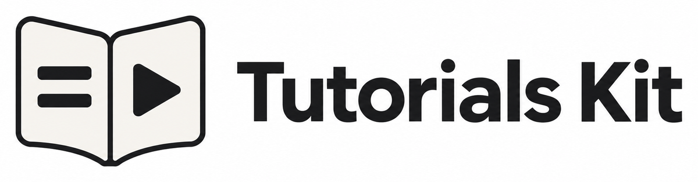

# Brand assets

The Tutorials Kit mark is an open guide: written steps on the left and a play symbol on the right. It
represents the two outputs of a browser workflow: a written guide and a narrated tutorial video.

<picture>
  <source media="(prefers-color-scheme: dark)" srcset="assets/tutorials-kit-logo-dark.png">
  
</picture>

## Downloads

| Asset                                                             | Intended use                                                            |
| ----------------------------------------------------------------- | ----------------------------------------------------------------------- |
| [Logo for light backgrounds](assets/tutorials-kit-logo-light.png) | Documentation, presentations, and pages with a white background.        |
| [Logo for dark backgrounds](assets/tutorials-kit-logo-dark.png)   | Documentation, presentations, and pages with a dark background.         |
| [App icon, 1024 × 1024](assets/tutorials-kit-icon.png)            | Repository icons, avatars, launchers, and other square placements.      |
| [Favicon, 32 × 32](assets/tutorials-kit-icon-32.png)              | Browser tabs and other small placements.                                |
| [Apple touch icon, 180 × 180](../apple-touch-icon.png)            | Home-screen icons and repository tools that discover a root-level icon. |

The icon PNGs have transparent backgrounds around the ivory and graphite guide. The wordmarks have solid
backgrounds; choose the version that matches the surrounding surface. Preserve the aspect ratio and leave some
space around each asset.

## Colors

| Color            | Hex       |
| ---------------- | --------- |
| Warm ivory       | `#F5F3EF` |
| Graphite         | `#161719` |
| Light background | `#FFFFFF` |
| Dark background  | `#0D1117` |

Use **Tutorials Kit** as the displayed product name and `tutorials-kit` for the npm package and primary CLI
command.
